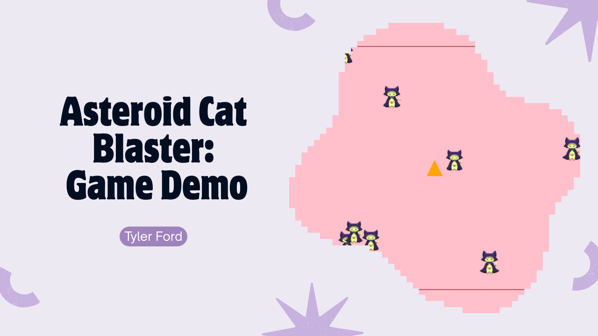

# 🐱 Asteroid Cat Blaster

  
👉 [**Click here to watch the demo**](https://youtu.be/rgicynY4iVs)

A fun, retro-style JavaScript browser game where you blast space cats (yes, cats!) with your orange spaceship. Choose your difficulty, dodge incoming feline asteroids, and rack up points to reach victory. Inspired by classic arcade shooters — but fluffier.

## 🎮 Features

- Smooth ship movement with friction-based physics  
- Cat sprite-based asteroids using a sprite sheet  
- Shooting with cooldown mechanics and a rapid-fire limiter  
- Win/Lose screens based on score or damage taken  
- Difficulty selection (Easy / Medium / Hard)  
- Save your name and score to a persistent **local leaderboard**  
- Responsive restart (`R`) and save (`S`) keybinds  
- Cute aesthetic: pink space background, Courier font, and cat chaos  

## 🕹️ Controls

| Key        | Action                                   |
|------------|------------------------------------------|
| Arrow Keys | Move the spaceship                       |
| Spacebar   | Shoot bullets                            |
| R          | Restart the game                         |
| S          | Save your score to leaderboard (after game ends) |

## 🧠 Win Conditions

- **Easy** – 2,500 points  
- **Medium** – 5,000 points  
- **Hard** – 7,500 points  
  *(Each asteroid hit = +100 points)*  

You **lose** if your ship takes **20 hits** from the cat-asteroids.

## 📦 How to Run It

Play instantly on GitHub Pages:  
👉 **[Play the Game Here](https://tylerford2.github.io/asteroid-cat-blaster/)**

> This game runs entirely in the browser — no downloads, no dependencies.  
> Built with 💯 **vanilla JavaScript**, HTML5 canvas, and CSS.

## 🐾 Assets & Credits
Cat asteroid sprites from [**Witch Kitty**](https://chariart.itch.io/witchkitty) by ChariArt  
Used under the Creative Commons license from itch.io

- **Cat Sprite Sheet**: [witchKitty_curiousIdleBreaker.png](./witchKitty_curiousIdleBreaker.png)
  (Uses a 3x4 grid = 12 sprite frames. Each asteroid randomly selects a frame.)  
- Background: pink sky
- Ship: orange triangle rendered via canvas

## 💾 Leaderboard Storage

Leaderboard entries are stored in your browser via `localStorage`.  
You can clear them with developer tools or by adding a "Clear Leaderboard" button.

---

Made with ❤️ in JavaScript and caffeine.
